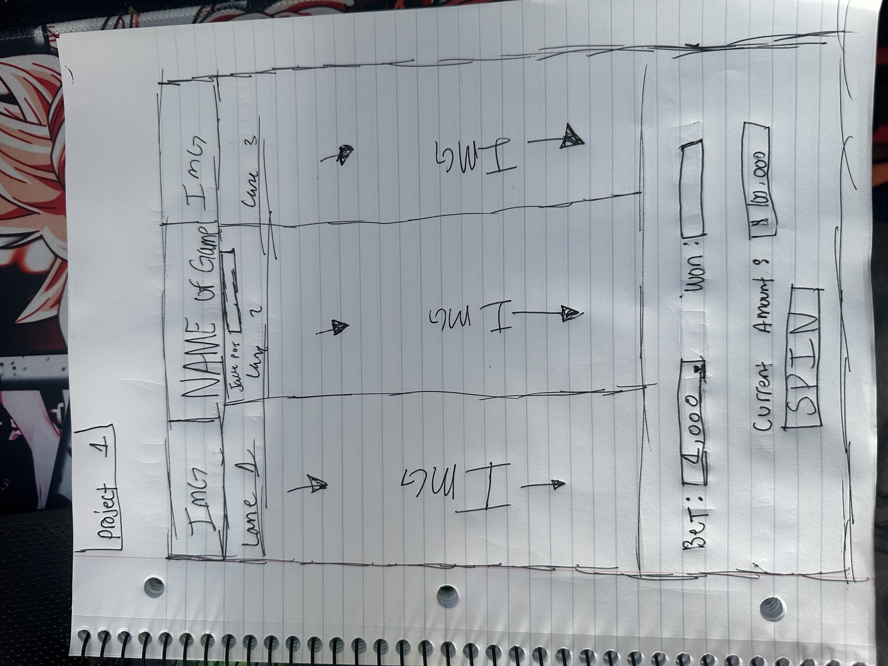

# My first project 
#### A slot machince application created from scratch for my first GA project.

## Description 
the name of my application is "Leaf Village Slots" its a simple 3 lane slot machine game with a balance and bet feature with a loss you will lose wager amount from balance and with a winning spin that lands on 3 matching symbols will result in a double your wager win unless you land on jackpot then you will earn jackpot amount.

## Languages Used
* JavaScript
* HTML
* CSS

## Feautures 
* user can choose custom wager amount 
* user can spin the machine resulting in symbols changing resulting in a win or loss 
* user can see if its a win or lost by the updating the balance amount and also a winning or lossing img displaying 

## WireFrame IMG
* original WireFrame

## Trello Planning 
<a href="https://trello.com/b/iDiX4SUX/project-1">Click Here</a>

## Github Repo link
<a href="https://github.com/Johnny3140/Project-1-Slots">GitHub Repository</a>

## Deployed Page 
<a href="https://johnny3140.github.io/Project-1-Slots/">Deployed Page</a>

## Progress Photos 
* basic layout 
* Symbol IMGS added 
* Final Application 

## Work Cited:
* N/A

